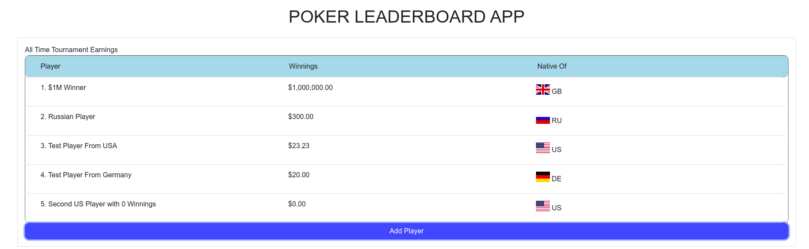
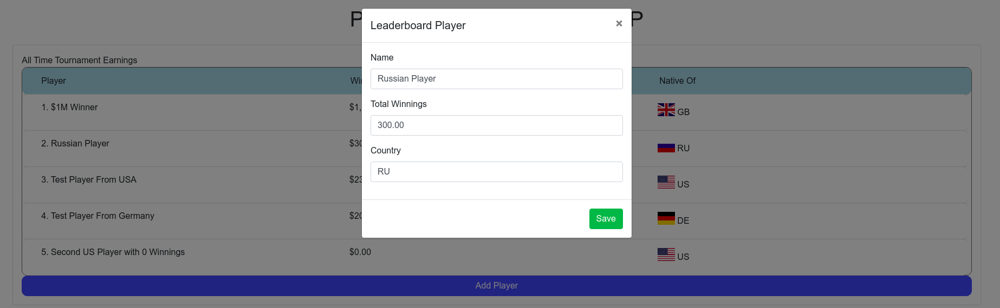
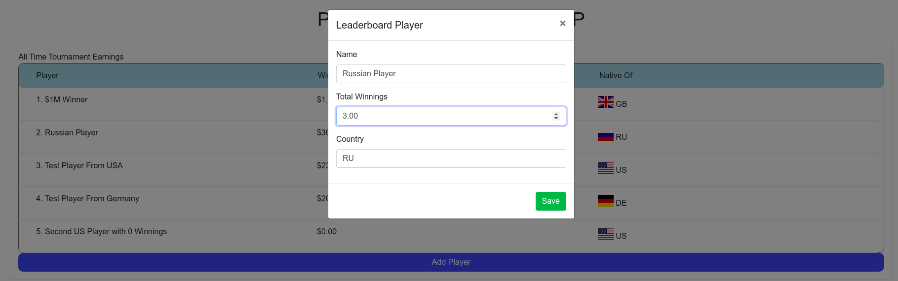
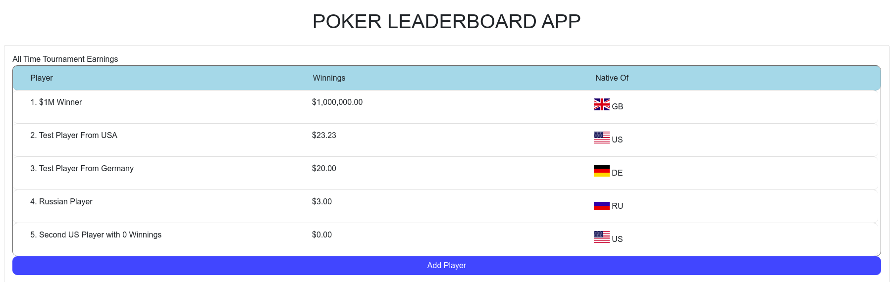
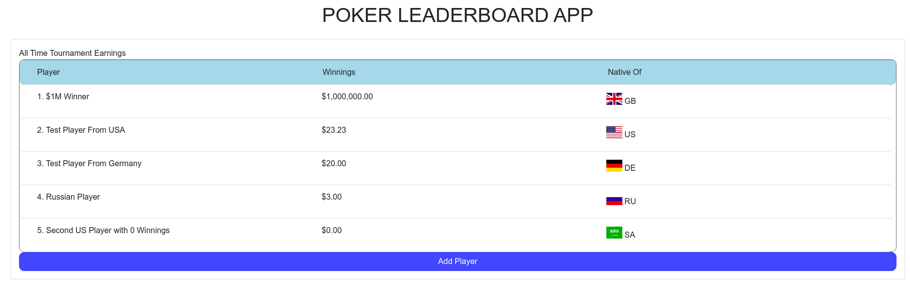

# React/Django Leaderboard Application

- Sample leaderboard demo with a Django backend and React front-end.

- Backend served out of `backend` directory. Built with Python3.6

- Frontend hosted out of `frontend` directory. Built with React, Bootstrap, Reactstrap, and react-country-flag

# Run the Backend Automatically
1. `./backend/run.sh` (requires python 3.6 as `python3.6` executeable somewhere in the users $PATH)

## Or Manually
1. `cd backend`
2. `python3.6 -m pip install -r Requirements.txt`
3. `python3.6 manage.py runserver`


# Run the frontend
1. `cd frontend`
2. `npm i`
3. `npm run start`

## Application Description
- The backend utilizes sqlite for persistence
- Utilizes Django models for communication with database layer
- utilizes the Django-rest-framework to auto generate CRUD methods. Example usage in `backend/urls.py`
- Django models defined in `backend/leaderboard/models.py`
- Admin backend available for modifying sqlite entries
    - Generate a superuser with `python3.6 backend/manage.py createsuperuser`
- Exposed api routes:
    - `/api/leaderboard/`
    - `/api/leadboard/:id:/`
- Admin functionality exposed on port `8000` at:
    - `/admin/`
    - `/admin/leaderboard/`
    - `/admin/leaderboard/:id/`
- Front-end utilized these routes to fetch, update, and create leaderboard entries.
- Front-end uses the `axios` library to hit the backend.
- Calls are proxied via `"proxy": "http://localhost:8000"` in `frontend/package.json`
- Application available on `localhost:3000` when running.
- Entries can be added with the `Add Player` button.
- Entries auto-sort by winning's value in descending order.
- Flag appears automatically next to recognized country codes such as `US`, `GE`, `RU`, etc
- Entries in the leaderboard can be clicked to edit details.
- `frontend/src/index.css` shows how to include static css files.
- `frontend/src/App.js` shows how to use inline style and style composition:
```js
const roundedStyle = {
  mozBorderRadius: '10px',
  webkitBorderRadius: '10px',
  borderRadius: '10px', /* future proofing */
  khtmlBorderRadius: '10px' /* for old Konqueror browsers */
}

const pointerStyle = {
  cursor: 'pointer'
}

const lineItemStyle = Object.assign({}, roundedStyle, pointerStyle)
const headerStyle = Object.assign({}, roundedStyle, {backgroundColor: 'lightblue'})
const orderedListStyle = Object.assign({}, roundedStyle, {listStyleType: 'decimal'})

```

- `frontend/src/components/Modal.js` shows a re-useable component for the Edit/Create functionality.
- `frontend/src/App.js` shows an example of i18n currency:
```js
  formatCurrency = (num) => {
    const formatter = new Intl.NumberFormat('en-US', {
      style: 'currency',
      currency: 'USD',
      minimumFractionDigits: 2
    })
    return formatter.format(num)
  }
```

# Future Adaptations
1. Normalize the database
    1. `winnings` should be calculated off of a `transactions` table counting all wins and losses foreign keyed to used by their ID

# Screenshots
- Example Leaderboard with data

- Click on Someone

- Change their winnings

- Save and the board re-orders

- Click someone else and change their country

- The flag auto-updates if a recognized country code was used



